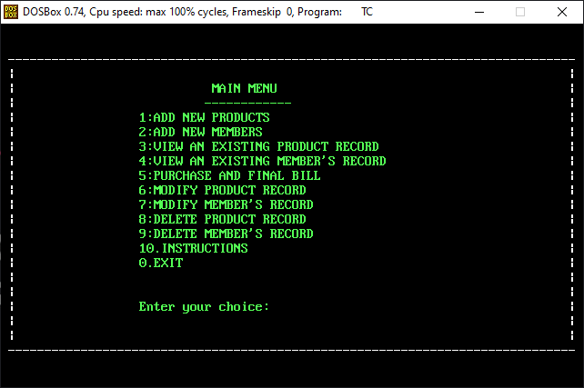
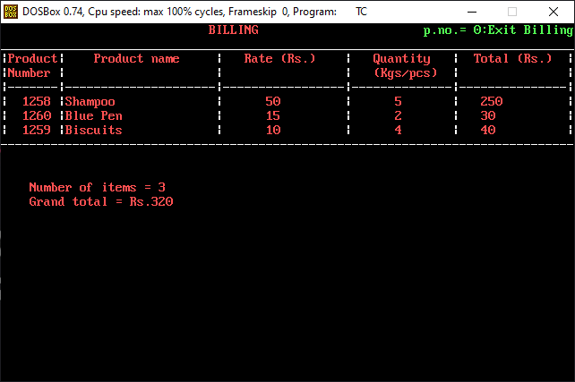
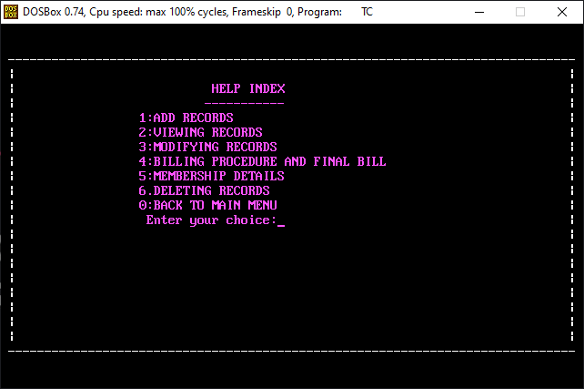

# Computerized Billing System (Program)

> This is a TurboCPP program which maintains information regarding Stock of different Items and Consumer (/Buyers) details for a Shop.

> It offers Addition, Modification and Deletion of Items and Consumers details.

> This System also offers Purchase Window and produces a Final Bill for each purchase.

## Images

Main menu \

Purchase and Billing \

- For more details, Please Open the Instructions (Help Index) tab in the main menu of the Program.

Instructions (Help Index) \

❤️ This was my very first Project, which I
wrote in the Summer of 2018.
